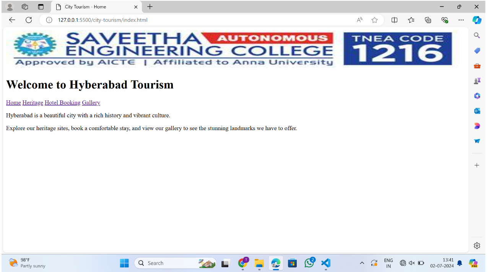
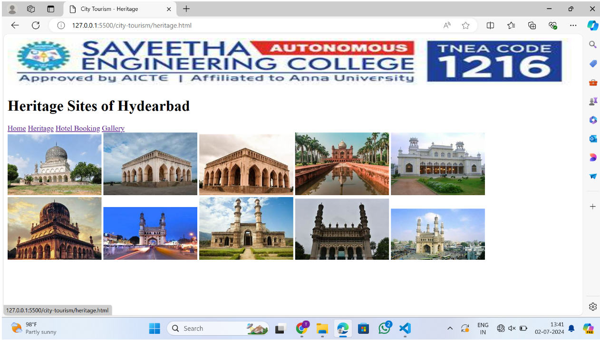
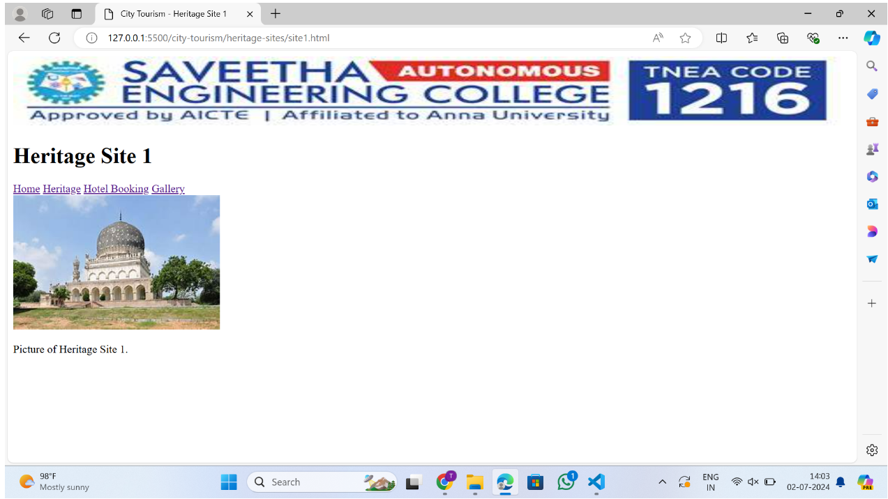
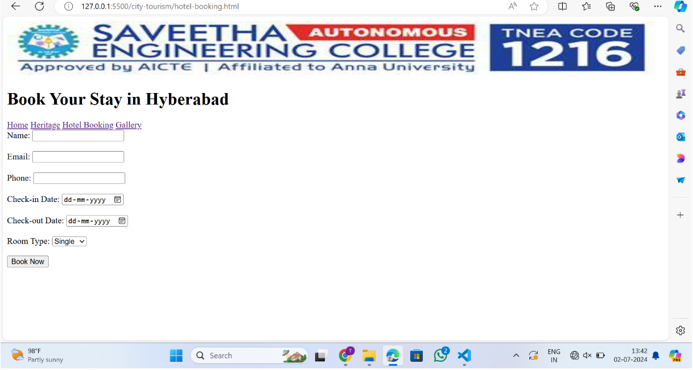

html-city-tourism

Aim: To impement a web page for city Tourism

Program:

home.html
```
<!DOCTYPE html>
<html lang="en">
<head>
    <meta charset="UTF-8">
    <title>City Tourism</title>
    <style>
        body {
            background-color: #f0f0f0; 
        }
        .header {
            text-align: center;
        }
        .navbar {
            text-align: center;
            margin: 20px;
        }
        .navbar a {
            margin: 0 15px;
            text-decoration: none;
        }
        .content {
            text-align: center;
            margin: 20px;
        }
    </style>
</head>
<body>
    <div class="header">
        
        <h1>Welcome to Hyberabad Tourism</h1>
    </div>
    <div class="navbar">
        <a href="index.html">Home</a>
        <a href="heritage.html">Heritage</a>
        <a href="hotel-booking.html">Hotel Booking</a>
        <a href="gallery.html">Gallery</a>
    </div>
    <div class="content">
        <p>Welcome to SEC - Saveetha Engineering College (Autonomous), a distinguished institution established in 2001 under the visionary leadership of Dr. N. M. Veeraiyan— a committed medical professional and philanthropist par excellence. </p>
           <p> With over 35 years of unwavering commitment to excellence in education, our college has emerged as the forefront of engineering education and research.</p>
    </div>
</body>
</html>
```
heritage.html
```
<!DOCTYPE html>
<html lang="en">
<head>
    <meta charset="UTF-8">
    <title>City Tourism - Heritage</title>
</head>
<body>
    <div class="header">
        
        <h1>Heritage Sites of Hydearbad</h1>
    </div>
    <div class="navbar">
        <a href="index.html">Home</a>
        <a href="heritage.html">Heritage</a>
        <a href="hotel-booking.html">Hotel Booking</a>
        <a href="gallery.html">Gallery</a>
    </div>
    <div class="content">
      
            <a href="heritage-sites/site1.html"></a>
            <a href="heritage-sites/site2.html"></a>
            <a href="heritage-sites/site3.html"></a>
            <a href="heritage-sites/site4.html"></a>
            <a href="heritage-sites/site5.html"></a>
            <a href="heritage-sites/site6.html"></a>
            <a href="heritage-sites/site7.html"></a>
            <a href="heritage-sites/site8.html"></a>
            <a href="heritage-sites/site9.html"></a>
            <a href="heritage-sites/site10.html"></a>
        
    </div>
</body>
</html>
```

hotel-bokking.html

```
<!DOCTYPE html>
<html lang="en">
<head>
    <meta charset="UTF-8">
    <title>City Tourism - Hotel Booking</title>
</head>
<body>
    <div class="header">
        
        <h1>Book Your Stay in Hyberabad</h1>
    </div>
    <div class="navbar">
        <a href="index.html">Home</a>
        <a href="heritage.html">Heritage</a>
        <a href="hotel-booking.html">Hotel Booking</a>
        <a href="gallery.html">Gallery</a>
    </div>
    <div class="content">
        <form action="submit-booking.html" method="post">
            <label for="name">Name:</label>
            <input type="text" id="name" name="name"><br><br>
            <label for="email">Email:</label>
            <input type="email" id="email" name="email"><br><br>
            <label for="phone">Phone:</label>
            <input type="tel" id="phone" name="phone"><br><br>
            <label for="checkin">Check-in Date:</label>
            <input type="date" id="checkin" name="checkin"><br><br>
            <label for="checkout">Check-out Date:</label>
            <input type="date" id="checkout" name="checkout"><br><br>
            <label for="roomtype">Room Type:</label>
            <select id="roomtype" name="roomtype">
                <option value="single">Single</option>
                <option value="double">Double</option>
                <option value="suite">Suite</option>
            </select><br><br>
            <input type="submit" value="Book Now">
        </form>
    </div>
</body>
</html>
```

gallery.html

```
<!DOCTYPE html>
<html lang="en">
<head>
    <meta charset="UTF-8">
    <title>City Tourism - Gallery</title>
</head>
<body>
    <div class="header">
        
        <h1>Gallery of Hyberabad</h1>
    </div>
    <div class="navbar">
        <a href="index.html">Home</a>
        <a href="heritage.html">Heritage</a>
        <a href="hotel-booking.html">Hotel Booking</a>
        <a href="gallery.html">Gallery</a>
    </div>
    <div class="content">
        
        
        
        
    </div>
</body>
</html>
```

site1.html

```
<!DOCTYPE html>
<html lang="en">
<head>
    <meta charset="UTF-8">
    <title>City Tourism - Heritage Site 1</title>
</head>
<body>
    <div class="header">
        
        <h1>Heritage Site 1</h1>
    </div>
    <div class="navbar">
        <a href="../index.html">Home</a>
        <a href="../heritage.html">Heritage</a>
        <a href="../hotel-booking.html">Hotel Booking</a>
        <a href="../gallery.html">Gallery</a>
    </div>
    <div class="content">
        
        <p>Description and history of Heritage Site 1.</p>
    </div>
</body>
</html>
```

site2.html

```
<!DOCTYPE html>
<html lang="en">
<head>
    <meta charset="UTF-8">
    <title>City Tourism - Heritage Site 2</title>
</head>
<body>
    <div class="header">
        
        <h1>Heritage Site 2</h1>
    </div>
    <div class="navbar">
        <a href="../index.html">Home</a>
        <a href="../heritage.html">Heritage</a>
        <a href="../hotel-booking.html">Hotel Booking</a>
        <a href="../gallery.html">Gallery</a>
    </div>
    <div class="content">
        
        <p>Description and history of Heritage Site 2.</p>
    </div>
</body>
</html>
```

site3.html

```
<!DOCTYPE html>
<html lang="en">
<head>
    <meta charset="UTF-8">
    <title>City Tourism - Heritage Site 3</title>
</head>
<body>
    <div class="header">
        
        <h1>Heritage Site 3</h1>
    </div>
    <div class="navbar">
        <a href="../index.html">Home</a>
        <a href="../heritage.html">Heritage</a>
        <a href="../hotel-booking.html">Hotel Booking</a>
        <a href="../gallery.html">Gallery</a>
    </div>
    <div class="content">
        
        <p>Description and history of Heritage Site 3.</p>
    </div>
</body>
</html>
```

site4.html

```
<!DOCTYPE html>
<html lang="en">
<head>
    <meta charset="UTF-8">
    <title>City Tourism - Heritage Site 4</title>
</head>
<body>
    <div class="header">
        
        <h1>Heritage Site 4</h1>
    </div>
    <div class="navbar">
        <a href="../index.html">Home</a>
        <a href="../heritage.html">Heritage</a>
        <a href="../hotel-booking.html">Hotel Booking</a>
        <a href="../gallery.html">Gallery</a>
    </div>
    <div class="content">
        
        <p>Description and history of Heritage Site 4.</p>
    </div>
</body>
</html>
```

site5.html

```
<!DOCTYPE html>
<html lang="en">
<head>
    <meta charset="UTF-8">
    <title>City Tourism - Heritage Site 5</title>
</head>
<body>
    <div class="header">
        
        <h1>Heritage Site 5</h1>
    </div>
    <div class="navbar">
        <a href="../index.html">Home</a>
        <a href="../heritage.html">Heritage</a>
        <a href="../hotel-booking.html">Hotel Booking</a>
        <a href="../gallery.html">Gallery</a>
    </div>
    <div class="content">
        
        <p>Description and history of Heritage Site 5.</p>
    </div>
</body>
</html>

```
site6.html

```
<!DOCTYPE html>
<html lang="en">
<head>
    <meta charset="UTF-8">
    <title>City Tourism - Heritage Site 6</title>
</head>
<body>
    <div class="header">
        
        <h1>Heritage Site 6</h1>
    </div>
    <div class="navbar">
        <a href="../index.html">Home</a>
        <a href="../heritage.html">Heritage</a>
        <a href="../hotel-booking.html">Hotel Booking</a>
        <a href="../gallery.html">Gallery</a>
    </div>
    <div class="content">
        
        <p>Description and history of Heritage Site 6.</p>
    </div>
</body>
</html>

```

site7.html

```
<!DOCTYPE html>
<html lang="en">
<head>
    <meta charset="UTF-8">
    <title>City Tourism - Heritage Site 7</title>
</head>
<body>
    <div class="header">
        
        <h1>Heritage Site 7</h1>
    </div>
    <div class="navbar">
        <a href="../index.html">Home</a>
        <a href="../heritage.html">Heritage</a>
        <a href="../hotel-booking.html">Hotel Booking</a>
        <a href="../gallery.html">Gallery</a>
    </div>
    <div class="content">
        
        <p>Description and history of Heritage Site 7.</p>
    </div>
</body>
</html>

```

site8.html

```
<!DOCTYPE html>
<html lang="en">
<head>
    <meta charset="UTF-8">
    <title>City Tourism - Heritage Site 8</title>
</head>
<body>
    <div class="header">
        
        <h1>Heritage Site 8</h1>
    </div>
    <div class="navbar">
        <a href="../index.html">Home</a>
        <a href="../heritage.html">Heritage</a>
        <a href="../hotel-booking.html">Hotel Booking</a>
        <a href="../gallery.html">Gallery</a>
    </div>
    <div class="content">
        
        <p>Description and history of Heritage Site 8.</p>
    </div>
</body>
</html>

```

site9.html

```
<!DOCTYPE html>
<html lang="en">
<head>
    <meta charset="UTF-8">
    <title>City Tourism - Heritage Site 9</title>
</head>
<body>
    <div class="header">
        
        <h1>Heritage Site 9</h1>
    </div>
    <div class="navbar">
        <a href="../index.html">Home</a>
        <a href="../heritage.html">Heritage</a>
        <a href="../hotel-booking.html">Hotel Booking</a>
        <a href="../gallery.html">Gallery</a>
    </div>
    <div class="content">
        
        <p>Description and history of Heritage Site 9.</p>
    </div>
</body>
</html>

```

site10.html

```
<!DOCTYPE html>
<html lang="en">
<head>
    <meta charset="UTF-8">
    <title>City Tourism - Heritage Site 10</title>
</head>
<body>
    <div class="header">
        
        <h1>Heritage Site 10</h1>
    </div>
    <div class="navbar">
        <a href="../index.html">Home</a>
        <a href="../heritage.html">Heritage</a>
        <a href="../hotel-booking.html">Hotel Booking</a>
        <a href="../gallery.html">Gallery</a>
    </div>
    <div class="content">
        
        <p>Description and history of Heritage Site 10.</p>
    </div>
</body>
</html>

```
OUTPUT





